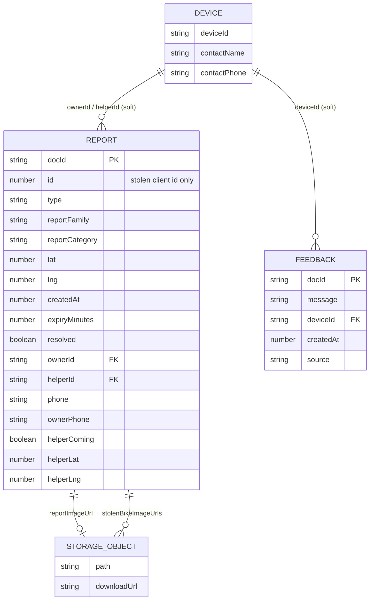

# Totimoto — Firestore Data Architecture

**Task ID:** TRN-001-DATA-ARCHITECTURE  
**Date:** 2026-07-29  
**Scope:** Deep analysis of application data architecture  
**Status:** Report only — no code was modified

---

## 0. Summary

The app uses **two Firestore collections** and **two Storage path prefixes**. There is **no users collection**, **no Auth-linked identity**, and **no composite queries** in code today.

| Store | Name / path | Role |
|-------|-------------|------|
| Firestore | `reports` | All live map reports (all families in one collection) |
| Firestore | `feedback` | Beta user feedback messages |
| Storage | `report-images/` | Optional photos for non-stolen reports |
| Storage | `stolen-bikes/` | Stolen-bike photos (0–5 per report) |

**All Firestore I/O lives in a single React component:** `src/App.tsx`  
**Firebase init:** `src/firebase.ts` (`db`, `storage`)

```
┌──────────────────────────────────────────────────────────────┐
│                         App.tsx                               │
│  localStorage: deviceId, contactName, contactPhone            │
│  React state: reports[], selectedReport, GPS, modals…         │
└───────────────┬───────────────────────────────┬───────────────┘
                │                               │
                ▼                               ▼
        Cloud Firestore                 Firebase Storage
   ┌────────────────────┐         ┌─────────────────────────┐
   │ reports (docs)     │────────►│ reportImageUrl (URL)    │
   │ feedback (docs)    │         │ stolenBikeImageUrls[]   │
   └────────────────────┘         │   → report-images/*     │
                                  │   → stolen-bikes/*      │
                                  └─────────────────────────┘
```

---

## 1. Every Firestore Collection

### 1.1 `reports`

| Property | Value |
|----------|--------|
| Path | `/reports/{reportDocId}` |
| Purpose | Single polymorphic collection for road intel, assistance, shared rides, and stolen bikes |
| Document ID | Auto-generated by `addDoc` |
| Read pattern | Full-collection `onSnapshot` (no `where` / `orderBy`) |
| Write pattern | `addDoc`, `updateDoc`, `deleteDoc` |
| Subcollections | None |

### 1.2 `feedback`

| Property | Value |
|----------|--------|
| Path | `/feedback/{feedbackDocId}` |
| Purpose | In-app beta feedback (“ساعدنا نحسن توتيموتو”) |
| Document ID | Auto-generated by `addDoc` |
| Read pattern | **None in the app** (write-only from client) |
| Write pattern | `addDoc` only |
| Subcollections | None |

### 1.3 Collections that do **not** exist (but are implied by product needs)

| Missing collection | Why it matters |
|--------------------|----------------|
| `users` / `profiles` | Identity is only `localStorage.deviceId` |
| `helpers` / `assignments` | Helper state is denormalized onto the report |
| `reportHistory` / `events` | No audit trail of accepts/cancels/GPS samples |
| `devices` | No push-token or session registry |

---

## 2. Document Structures

### 2.1 `reports` — polymorphic document model

One collection, four **logical families** via `reportFamily`:

| `reportFamily` | Meaning | Typical `reportCategory` |
|----------------|---------|---------------------------|
| `intelligence` | Road conditions | `traffic`, `accident`, `road_closed`, `slippery_road` |
| `assistance` | Roadside help | `bike_broken`, `push`, `fuel` |
| `sharedRide` | Ride sharing | `ride` |
| `stolen` | Stolen motorcycle alert | `stolen` |

There is **no Firestore discriminator enforcement** — family is a plain string field written by the client.

### 2.2 `feedback` — flat message document

Simple append-only message with optional contact attribution.

---

## 3. Every Field

### 3.1 `reports` — complete field catalog

Fields observed from creates, updates, the `ReportItem` type, and UI reads.  
**Source legend:** C = create path(s), U = update path(s), R = read in UI, T = typed but not clearly written by current create paths.

#### A. Identity & document keys

| Field | Type (observed) | Source | Notes |
|-------|-----------------|--------|-------|
| *(document id)* | string | Firestore auto-ID | Used as `report.id` after snapshot maps `id: doc.id` |
| `id` | number | C (stolen only) | Client `Date.now()` — **not** the Firestore doc ID; duplicated/confusing |

#### B. Classification & presentation

| Field | Type | Source | Notes |
|-------|------|--------|-------|
| `type` | string | C | Arabic display label (e.g. `"زحمة"`, `"بلاغ عن دراجة مسروقة"`) |
| `reportFamily` | string | C | `intelligence` \| `assistance` \| `sharedRide` \| `stolen` |
| `reportCategory` | string | C | Machine-ish category slug |
| `emoji` | string | C | UI glyph |
| `color` | string | C | Hex color for marker |
| `priority` | string | C | `"high"` \| `"medium"` \| `"low"` (not always set on legacy `addReport`) |
| `label` | string? | C (`createUserReport` via `...type`) | **Accidental denormalization** — UI config key may be written into Firestore |

#### C. Location

| Field | Type | Source | Notes |
|-------|------|--------|-------|
| `lat` | number | C | Report latitude |
| `lng` | number | C | Report longitude |
| `area` | string | C | From Nominatim reverse geocode |
| `street` | string | C | From Nominatim |
| `city` | string | C | From Nominatim |
| `district` | string | C | From Nominatim |
| `locationName` | string | C | Joined display string |
| `distance` | string | C | Display-only (“الآن”, “مباشر”) — **not** computed distance |

#### D. Lifecycle / expiry

| Field | Type | Source | Notes |
|-------|------|--------|-------|
| `createdAt` | number | C | Epoch **milliseconds** |
| `expiry` | number | C | Duration in **minutes** (not a timestamp) |
| `resolved` | boolean | C + U | Soft completion flag |
| `solvedAt` | number | U (`resolveReport`) | Epoch ms when marked solved |

Soft-expiry rule used client-side only:

```
alive ⇔ (Date.now() - createdAt) / 60000 < expiry
```

Expired docs are **filtered in React**, not deleted in Firestore.

#### E. Ownership & contact

| Field | Type | Source | Notes |
|-------|------|--------|-------|
| `ownerId` | string | C | Equals client `deviceId` from `localStorage` |
| `ownerName` | string | C (`createUserReport`) | From contact form |
| `ownerPhone` | string | C (`createUserReport`) | Same value as `phone` |
| `phone` | string | C (`createUserReport`) | **Duplicate** of `ownerPhone` |
| `description` | string | C | Optional free text |
| `reportImageUrl` | string | C | Full HTTPS download URL (or `""`) |

#### F. Helper workflow (denormalized onto report)

| Field | Type | Source | Notes |
|-------|------|--------|-------|
| `helperComing` | boolean | C + U | Claimed / in transit |
| `helperArrived` | boolean | C | Written `false` on create; **never updated to true** in current code |
| `helperStatus` | string | U | e.g. `"مساعد بالطريق"`; cleared to `""` on cancel |
| `helpers` | number | C + U | Treated as 0 or 1 (not a real roster) |
| `helpersList` | array | C | Always `[]` on create; never populated |
| `joined` | boolean | U | Mirror of “someone joined”; overlaps `helperComing` |
| `helperId` | string | U | Helper’s `deviceId` |
| `helperName` | string | U | From helper’s localStorage |
| `helperPhone` | string | U | From helper contact |
| `helperAcceptedAt` | number \| null | U | Epoch ms; set `null` on cancel |
| `helperLat` | number \| null | U | Live helper GPS |
| `helperLng` | number \| null | U | Live helper GPS |
| `helperLocationUpdatedAt` | number | U | Last GPS write time |

#### G. Stolen-bike extension fields

Present when `reportFamily === "stolen"` (and only written by `submitStolenBikeReport`):

| Field | Type | Source | Notes |
|-------|------|--------|-------|
| `stolenBikeType` | string | C | Free text |
| `stolenBikeColor` | string | C | Free text |
| `stolenBikePlate` | string | C | Free text |
| `stolenBikePhone` | string | C | Contact for bike owner (separate from `phone`/`ownerPhone`) |
| `stolenBikePlace` | string | C | Place text from form |
| `stolenBikeDate` | string | C | HTML date input value |
| `stolenBikeTime` | string | C | HTML time input value |
| `stolenBikeImageUrls` | string[] | C | Download URLs (0–5) |

#### H. Typed / legacy fields rarely or never persisted by current writers

| Field | In `ReportItem`? | Written to Firestore? | Notes |
|-------|------------------|------------------------|-------|
| `helperTargetLat` | yes | no (current writers) | Local animation leftover |
| `helperTargetLng` | yes | no | Local animation leftover |
| `helperMoving` | yes | no | Local animation leftover |
| `moving` / `targetLat` / `targetLng` / `isHelper` | no (runtime) | no | Client-only animation paths |

---

### 3.2 Create-path field matrices (what each writer actually stores)

#### Path A — `createUserReport` (primary UI path today)

Triggered from description modal after type selection.

| Field set | Always? |
|-----------|---------|
| `ownerId`, `phone`, `ownerPhone`, `ownerName` | yes (phones may be empty string if contact skipped incorrectly) |
| `description`, `reportImageUrl` | yes (`reportImageUrl` may be `""`) |
| Spreads `...type` then overwrites: `type`, `color`, `emoji`, `priority`, `expiry` | yes — may also persist `label`, `reportFamily`, `reportCategory` from type object |
| `helperComing`, `helperArrived`, `helpers`, `helpersList`, `resolved` | yes |
| Location block: `area`, `street`, `city`, `district`, `locationName`, `distance`, `lat`, `lng` | yes |
| `createdAt` | yes |
| Stolen-specific fields | no |

#### Path B — `submitStolenBikeReport`

| Field set | Always? |
|-----------|---------|
| Client `id: Date.now()` | yes |
| Classification: stolen type/family/category/emoji/priority/color/expiry | yes |
| `ownerId` | yes |
| Location from hardcoded lat/lng `33.8938, 35.5018` + Nominatim | yes |
| Helper defaults: `helperComing`, `helperArrived`, `helpers`, `resolved` | yes |
| Stolen fields + `stolenBikeImageUrls` | yes |
| `phone` / `ownerPhone` / `ownerName` / `description` / `reportImageUrl` | **not set** |
| `helpersList` | **not set** |

#### Path C — `addReport` (legacy / alternate; still in file)

| Field set | Always? |
|-----------|---------|
| Owner + type + location + family/category + color/emoji | yes |
| `expiry` via **hardcoded label switch** (differs from `reportTypes.expiry`) | yes |
| `helpers`, `helpersList`, `helperComing` | yes |
| `priority`, `resolved`, phones, description, image | **not set** |

#### Path D — `sendReport` (local only)

Writes to **React state only** — does **not** call Firestore. Not part of the persisted schema, but can confuse audits of “create” flows.

---

### 3.3 `feedback` — every field

| Field | Type | Required | Notes |
|-------|------|----------|-------|
| `message` | string | yes | Trimmed user text |
| `deviceId` | string | yes | Same anonymous device id |
| `contactName` | string | yes | May be empty if user never saved contact |
| `contactPhone` | string | yes | May be empty |
| `createdAt` | number | yes | Epoch ms |
| `source` | string | yes | Constant `"beta-feedback"` |

No updates or deletes from the client.

---

## 4. Relationships Between Collections

```
                    localStorage
                 ┌─────────────────┐
                 │ deviceId        │◄──────────────────────────┐
                 │ contactName     │                           │
                 │ contactPhone    │                           │
                 └────────┬────────┘                           │
                          │ copied into                        │
                          ▼                                    │
              ┌───────────────────────┐                        │
              │      reports          │                        │
              │  ownerId ─────────────┼────────────────────────┤
              │  helperId ────────────┼────────────────────────┘
              │  ownerPhone / phone   │  (no FK; plain strings)
              │  helperPhone          │
              │  reportImageUrl ──────┼──► Storage object (URL, not path)
              │  stolenBikeImageUrls[]┼──► Storage objects (URLs)
              └───────────────────────┘

              ┌───────────────────────┐
              │      feedback         │
              │  deviceId ────────────┼──► same anonymous id (no join)
              │  contactName/Phone    │    soft reference only
              └───────────────────────┘
```

### Relationship rules (as implemented)

| Relationship | Mechanism | Integrity |
|--------------|-----------|-----------|
| Report → Owner | `ownerId === deviceId` | Soft; spoofable; no user doc |
| Report → Helper | `helperId === deviceId` | Soft; single helper slot |
| Report → Images | HTTPS URLs in fields | Soft; delete uses URL as Storage ref (fragile) |
| Feedback → Device | `deviceId` string | Soft; no cascade |
| `reports` ↔ `feedback` | None | Independent collections |

**There are no Firestore document references (`DocumentReference` fields), no subcollections, and no foreign-key validation.**

---

## 5. How Data Flows: React → Firestore

```
┌─────────────┐   geolocation / forms / UI clicks
│  App.tsx    │
│  useState   │
└──────┬──────┘
       │
       │ 1) CREATE
       │    compress image? → Storage uploadBytes → getDownloadURL
       │    Nominatim reverse geocode (HTTP)
       │    addDoc(collection(db,"reports"|"feedback"), payload)
       │
       │ 2) LIVE READ
       │    onSnapshot(collection(db,"reports"))
       │         → map docs to { ...data, id: doc.id }
       │         → setReports(liveReports)   // replaces entire array
       │
       │ 3) UPDATE
       │    updateDoc(doc(db,"reports", report.id), patch)
       │    (helper claim / cancel / resolve / GPS heartbeat)
       │
       │ 4) DELETE
       │    optional deleteObject(storage)
       │    deleteDoc(doc(db,"reports", id))
       │
       ▼
┌──────────────────────────────────────────┐
│ Firestore + Storage                       │
└──────────────────────────────────────────┘
       │
       │ snapshot fan-out to all connected clients
       ▼
┌──────────────────────────────────────────┐
│ Every open App instance re-renders map/list│
│ Client then filters: !resolved, not expired│
└──────────────────────────────────────────┘
```

### Important flow details

1. **Initial React state** seeds `startingReports` (hardcoded Beirut samples), then the first snapshot **overwrites** them.
2. **Expiry filtering** mutates local `reports` every 1s; the next snapshot can reintroduce expired docs from the server.
3. **`selectedReport`** is kept in sync via `useEffect` against live `reports`; cleared when resolved.
4. **Helper GPS** writes are throttled in React (`50m` OR `30s`), then patched onto the same report document.
5. **No optimistic Firestore transactions** — claim is a blind `updateDoc`.

---

## 6. Where Data Is Created

| Function | Collection | Storage side effect | UI trigger |
|----------|------------|---------------------|------------|
| `createUserReport` | `reports` | Optional `report-images/{ts}-{name}` | Description modal “نشر البلاغ” |
| `submitStolenBikeReport` | `reports` | Optional up to 5× `stolen-bikes/{ts}-{name}` | Stolen modal “نشر البلاغ” |
| `addReport` | `reports` | none | Legacy path (still in code; not primary UI) |
| `submitFeedback` | `feedback` | none | Settings → feedback page |

**Not created in Firestore:** local `sendReport()` (state only).

---

## 7. Where Data Is Updated

All updates target **`reports/{id}`** only. `feedback` is never updated.

| Function / effect | Fields patched | When |
|-------------------|----------------|------|
| `helperRespond` | `helperComing`, `helperStatus`, `helpers`, `joined`, `helperId`, `helperPhone`, `helperName`, `helperLat`, `helperLng`, `helperLocationUpdatedAt`, `helperAcceptedAt` | Helper accepts request |
| `resolveReport` | `resolved: true`, `solvedAt` | Owner marks solved |
| `cancelHelp` | `helperComing: false`, `helperStatus: ""`, `helpers: 0`, `joined: false`, `helperId: ""`, `helperAcceptedAt: null` | Helper cancels |
| Smart GPS `useEffect` | `helperLat`, `helperLng`, `helperLocationUpdatedAt` | Active helper moves / heartbeat |
| Commented legacy GPS effect | same GPS fields | Dead code (comment block) |

### Cancel-help incompleteness

`cancelHelp` **does not clear in Firestore:**

- `helperPhone`
- `helperName`
- `helperLat` / `helperLng`
- `helperLocationUpdatedAt`

Local `selectedReport` clears some of these, but the document may retain stale PII / GPS after cancel.

---

## 8. Where Data Is Deleted

| Function | Target | Also deletes |
|----------|--------|--------------|
| `cancelReport` | `deleteDoc(reports/{id})` | Attempts `deleteObject` for `reportImageUrl` only |
| Stolen “تم العثور على الدراجة” | Calls `cancelReport` | Same as above |
| Expired reports | **Not deleted** | Client filter only |
| Resolved reports | **Not deleted** | Remain with `resolved: true` |
| `feedback` | **Never deleted** by app | Accumulate forever |
| Stolen images on cancel | **Not deleted** | Only `reportImageUrl` path attempted |

`deleteReportImage` passes the **download URL** into `ref(storage, report.reportImageUrl)`. Storage refs normally need an object path; this often fails (caught + `console.warn`).

---

## 9. Which Components Use Each Collection

There is **no component tree split**. Usage map:

| Collection | Consumer | Operations |
|------------|----------|------------|
| `reports` | `App` in `src/App.tsx` only | listen, create, update, delete |
| `feedback` | `App` in `src/App.tsx` only | create |
| Storage | `App` helpers inside same file | upload, delete attempt |

### Logical UI regions inside `App` that **read** `reports` state

| UI region | Uses |
|-----------|------|
| Map markers / circles / helper marker | lat/lng, priority, colors, helper GPS |
| Top count badge | `visibleReports.length` |
| Reports page list + filters | nearly all report fields |
| Selected report sheets (stolen vs assistance) | family-specific fields + phones |
| Family count chips (partly disabled UI) | `reportFamily` counts |

### `feedback`

Only written from the legal/settings feedback panel; **never read back** in UI.

### Unused by any other file

`src/App copy.tsx` has **zero** Firestore usage (local prototype).

---

## 10. Missing Indexes

### Current query surface

```ts
onSnapshot(collection(db, "reports"), ...)
```

- No `where`
- No `orderBy`
- No `limit`
- No collection-group queries

**Therefore: no composite indexes are required for the code as written.**

There is also **no `firestore.indexes.json`** in the repository.

### Indexes that will be required if the app evolves to server-side filtering

| Intended query | Likely index needs |
|----------------|--------------------|
| Active reports only | `resolved ASC`, `createdAt DESC` |
| By family + fresh | `reportFamily ASC`, `createdAt DESC` |
| Unresolved assistance needing help | `reportFamily`, `helperComing`, `resolved`, `createdAt` |
| Nearby geo (if geohash added) | geohash + family + createdAt |
| Owner’s reports | `ownerId`, `createdAt` |
| Helper’s active job | `helperId`, `helperComing`, `resolved` |
| Feedback admin inbox | `createdAt DESC` or `source`, `createdAt` |

Until those queries exist, the bottleneck is **full-collection sync**, not missing indexes (see §13).

---

## 11. Missing Security Rules

### In-repo status

| Artifact | Present? |
|----------|----------|
| `firestore.rules` | **No** |
| `storage.rules` | **No** |
| Rules deployed in Firebase Console | Unknown from repo (not versioned here) |

### Effective security model assumed by the client

The client behaves as if:

- Anyone can **read all** `reports`
- Anyone can **create** `reports` / `feedback`
- Anyone who knows a doc id can **update** or **delete** it
- Ownership is enforced only by comparing `ownerId` / `helperId` to local `deviceId` **in the UI**, not in rules

### Critical rule gaps (required for production)

#### Firestore `reports`

Missing protections for:

1. Create: validate required fields, types, expiry bounds, lat/lng ranges (Lebanon bbox), max description length  
2. Update: only `helperId == auth.uid` (or equivalent) may set helper fields; only owner may resolve/delete  
3. Helper claim: allow claim only if `helperComing == false` (transactional / rule condition)  
4. GPS updates: only assigned helper may write `helperLat/Lng`  
5. Prevent arbitrary field injection (e.g. overwriting `ownerId`)  
6. Feedback: create-only; no public list; rate-limit via App Check if possible  

#### Storage

Missing protections for:

1. Auth-required uploads (or App Check)  
2. Path allowlists: `report-images/{uid}/**`, `stolen-bikes/{uid}/**`  
3. Content-type / size limits  
4. Read policy for public vs private images  
5. Delete only by uploader / owner  

#### Auth prerequisite

Without Firebase Auth (or custom tokens), robust rules are hard: `deviceId` in the document is **not a security boundary**.

---

## 12. Duplicated Data

### 12.1 Field-level duplication inside `reports`

| Duplication | Detail |
|-------------|--------|
| `phone` ↔ `ownerPhone` | Same contact number written twice in `createUserReport` |
| `type` ↔ `label` | Arabic label vs possible persisted UI `label` from spread |
| `type` ↔ `reportFamily` / `reportCategory` | Human label + enum-like fields; must stay manually consistent |
| `helperComing` ↔ `joined` ↔ `helpers` | Three fields encode one “claimed” state |
| `helperStatus` string ↔ booleans | Status text mirrors flags |
| `distance` string | Redundant with client-computed haversine; often static (“الآن”) |
| `area` / `street` / `city` / `district` ↔ `locationName` | Parts + pre-joined string |
| Client `id` (number) ↔ Firestore doc id | Stolen path stores both concepts |
| `emoji` / `color` / `priority` | Denormalized UI theme; could be derived from category |

### 12.2 Cross-store duplication

| Duplication | Detail |
|-------------|--------|
| Contact in `localStorage` and on each report | Name/phone copied at write time; later local edits do not update old reports |
| Image bytes in Storage + URL(s) on doc | Normal pattern, but URLs are not Storage paths |
| Feedback contact fields | Copy of same localStorage contact snapshot |

### 12.3 Create-path schema divergence (same collection, different shapes)

Documents produced by Path A / B / C are **not isomorphic**:

| Field | `createUserReport` | `submitStolenBikeReport` | `addReport` |
|-------|--------------------|--------------------------|-------------|
| `priority` | yes | yes | no |
| `resolved` | yes | yes | no |
| `phone` / `ownerPhone` | yes | no | no |
| `helpersList` | yes (`[]`) | no | yes (`[]`) |
| numeric `id` | no | yes | no |
| stolen* fields | no | yes | no |
| `expiry` source | `reportTypes.expiry` | fixed 43200 | separate switch (different numbers) |

This is schema drift inside one collection.

### 12.4 UI vs persisted duplication

- Family filters / type tabs re-derive categories from Arabic `type` strings in places, while `reportFamily` already exists.
- Assistance detection also uses substring lists (`assistanceTypes`) instead of solely `reportFamily === "assistance"`.

---

## 13. Scalability Risks

### 13.1 Full-collection realtime sync (highest risk)

Every client listens to **all** `reports` documents forever.

| Scale point | Effect |
|-------------|--------|
| Growing historical + resolved + expired docs | Larger initial payload + more snapshot traffic |
| Helper GPS heartbeats | Frequent `updateDoc` → all listeners re-download/re-emit doc |
| N concurrent users | Each GPS/update fans out to N clients |
| Mobile networks in Lebanon | Costly bandwidth / battery |

**There is no `limit`, geo query, TTL, or archival collection.**

### 13.2 Write amplification

| Source | Risk |
|--------|------|
| Helper GPS (30s or 50m) | Sustained writes per active help session |
| 1s client expiry filter | Local CPU churn; fights with snapshot reintroducing docs |
| No batching / throttling beyond helper GPS | Other updates are unthrottled |

### 13.3 Lack of contention control

Helper claim is not transactional:

```
read (UI) → updateDoc(helperComing: true, helperId: me)
```

Two helpers can race; last write wins; no queue.

### 13.4 Unbounded retention

| Data | Cleanup |
|------|---------|
| Expired reports | None server-side |
| Resolved reports | None |
| Feedback | None |
| Orphan Storage images | Likely accumulate |

Firestore costs and listen payloads grow monotonically without ops tooling.

### 13.5 Polymorphic mega-document

Packing intel + assistance + stolen + live GPS on one doc type:

- Harder indexing/security specialization  
- Stolen 30-day docs share listen channel with 15-minute traffic reports  
- Large `stolenBikeImageUrls` arrays inflate documents  

### 13.6 PII on hot documents

Phones and live coordinates sit on the same frequently updated report docs that every client mirrors — increases privacy blast radius if rules are open.

### 13.7 No pagination / virtualization of data layer

Even if UI lists are short, the **data layer always holds the full collection** in React memory.

### 13.8 External dependency coupling

Nominatim is called on every create (and stolen create). Under load this risks rate limits and slow creates, independent of Firestore quotas.

### 13.9 Storage path / delete reliability

Failed deletes + URL-as-ref pattern → orphaned blobs; storage cost rises silently.

### 13.10 Suggested future data shape (guidance only — not implemented)

```
reports_active/     # short-TTL, geo-indexed, listen here
reports_archive/    # cold history
users/{uid}         # profile + contact
help_sessions/{id}  # helper assignment + GPS trail subcollection
feedback/           # admin-only read
```

Or keep one `reports` collection but:

- Add Auth  
- Add security rules + App Check  
- Query `where("expiresAt", ">", now)` with proper timestamp field  
- Move GPS to a subcollection or separate `liveLocations/{reportId}` doc  
- Scheduled Cloud Function TTL deletes  

---

## 14. CRUD Matrix (quick reference)

| Op | `reports` | `feedback` | Storage |
|----|-----------|------------|---------|
| Create | `createUserReport`, `submitStolenBikeReport`, `addReport` | `submitFeedback` | uploads in create flows |
| Read | `onSnapshot` entire collection | none in app | via HTTPS URLs in UI `` |
| Update | `helperRespond`, `resolveReport`, `cancelHelp`, GPS effect | — | — |
| Delete | `cancelReport` | — | best-effort `deleteReportImage` |

---

## 15. Entity-Relationship Diagram



---

## 16. Data-Flow Sequence (assistance claim)

```mermaid
sequenceDiagram
  participant O as Owner device
  participant FS as Firestore reports/{id}
  participant H as Helper device

  O->>FS: addDoc(report, helperComing=false)
  FS-->>H: onSnapshot (new report)
  H->>FS: updateDoc(helperComing=true, helperId, phones, GPS)
  FS-->>O: onSnapshot (helper claimed)
  loop every 50m or 30s
    H->>FS: updateDoc(helperLat, helperLng, helperLocationUpdatedAt)
    FS-->>O: onSnapshot (helper moves on map)
  end
  O->>FS: updateDoc(resolved=true, solvedAt)
  FS-->>H: onSnapshot (resolved; UI clears selection)
```

---

## 17. Audit Closure

This document is the Firestore / data-architecture baseline for **TRN-001-DATA-ARCHITECTURE**.

**Findings in one line:** two flat collections, one polymorphic `reports` mega-document, anonymous device identity, full-collection listeners, no in-repo security rules or indexes file, and multiple create-path schemas with duplicated contact/helper fields.

**No application code was modified.**  
Stop.
